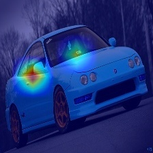
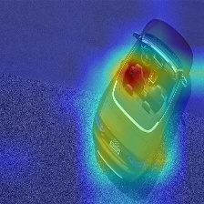
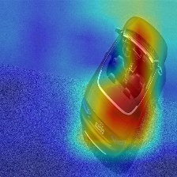

# 논문 방향

### 데이터셋 검증방법 및 보강을 위한 해결책

## 1. XAI - Grad_cam(guied_grad_cam)
- 데이터 셋 검증을 위한 방법 
- 검증 후 보강을 통해서 정확도를 올리기 위한 방법론 

## 검증 순서 및 가정 

1. 검증하고자 하는 데이터 셋을 대표적인 cnn모델(alex, vgg, resnet,googlenet, DenseNet, SENet)에 학습 시킨다. 
    - 일단 vgg 활용하고 있다. (grad_cam에서 사용 하였기 때문에) 
    - 개인적으로 cifar10으로 학습을 진행 
    - 범용적으로 pytorch vgg16 imgnet을 통한 pt 파일을 활용하여 grad_cam 진행 

2. 각 class의 다양한 모양,각도,색 등 변경하여 test img(검증하기 위한 데이터셋)을 준비 한다. - 가상환경으로 img, segmentation(GT)를 얻는다. 
    - test img의 파일명을 모양,각도,색을 이용하여 파일명을 수정 ex) y_60_bleft, r_0_f. w_0_b 
    - 아직 파일명에 대한 기준은 대략적으로만 잡음 
    - 일단 차량에 국한되어 판단 진행 중 
    - 현재는 실제 데이터들 활용하여 test img, segmentation을 만들어 진행 중 

3. (가정) xai가 한 이미지에서 어떤 부분을 중요하게 보는지 확인하는 방법이니, xai가 보는 것이 GT(bbox, segmentation)라 할 수 있다. 
    - (시작점) 각 레이어들 별로 xai를 뽑아서 GT와 비교 분석을 통해 데이터셋을 검증 할 수 있지 않을까? 

4. (현재)2번에서 만든 이미지로 1번의 cnn모델의 최종 레이어로 xai - grad_cam을 생성하여, GT와 비교 분석(objective function, costfuction 를 활용)
    - GT와의 교집합(intersection)을 통해 검증 방법을 진행 중 
    - 그 외의 objective / cost fuction을 통해 3가지 정도의 함수들을 활용하여 분석할 예정 
    - 일단 간단한 Intersection , Crossentropy 를 활용할 예정 

5. 2번의 test img 들의 grad_cam을 통해 부족한 데이터를 파악 후 - 파일명을 활용하여 그 와 비슷한 이미지를 추가 보강 (가상환경 데이터)

6. 보강 후 정확도 및 grad_cam을 통해 훈련의 향상 유무 파악

## 문제 사항
1. 어떤 목적함수를 사용해야 하는가? 
    - 픽셀값들을 crossentropy, binaryentropy 를 사용하고자 한다. 

    - 목적 함수를 쓰는 이유는 모델의 예측값과 실제 값의 오차를 줄이기 위해 사용하는데.. 이걸로 분석이 가능 할지 (실제로 해보지 않아서)

    - 교집합을 이용하여 분석 한다고 하지만, 어떤 식으로 분석을 할지... 
        - (개인적으로 만든 데이터셋 - cifar10) 잘 못 예측한 img의 grad_cam이 더 segmentation과 일치 한다. 비교적 잘 예측한 img는 극소 부분만 활성화 됨   
        (vgg16_50epoc_39.865_car)  
          
        (vgg16_50eoic_-11.168_car)  
        

        - (pytorch에서 제공하는 vgg16 - imgnet) 예측값이 높던 높지 않던 segmentation과 대부분 일치한다.  
        (torchvgg16pt_16.971_sports car)                           
          
        (torchvgg16pt_12.235_sports car)  
        

        - (현재) 각 값들을 수치화해서 Intersection을 하는 중 - 실제론 잘 못 예측한 것은 grad_cam의 픽셀의 값은 작을 수 있기 때문에 확인해보고자 한다. 

        
2. 어떤 함수를 만들어서 써야 하는가? 현재 진행 상황이 맞는건지..  

3. (후 순위)모델 마다 grad_cam 출력이 다르고, 학습량 마다 다르다 이 부분의 판단은 어떻게 할 것인가? 
    - 한싸이클 돌리고 나서 생각해 보자. 

---

## 피드백 - 조교수님, 다형님  
1. 한 싸이클을 돌려라.
    - 생각한 솔루션(단순한 - intersection)에 대한 한 싸이클을 돌려봐라 - 어짜피 문제점은 계속 발생 한다. 
2. 단순한 intersection 외에 강화학습에 사용되는 목적함수 사용해 봐라
    - 논문에 쓸 때 타당성을 더 추가할 수 있다.
    - 3가지 정도 사용해서 검증을 할 수 있다면 경쟁력이 충분히 있다. 
----

## 개인 - 진행상황 
1. 한 싸이클 돌릴 예정 
    - Pytorch에서 제공하는 (imgenet)vgg16.pt를 활용하여 grad_cam을 뽑는다. 
    - 각각의 test img의 grad_cam 값들을 확인해 본다. - heatmap 이미지 X 
        - img picxel의 비교를 통한 활성화(빨강 부분)일 수 있기 때문에 활성화 부분의 절대값을 뽑아 다른 img의 heatmap 활성화 픽셀과의 수치를 확인 해 볼 예정 

    - simple intersection을 활용한 비교 